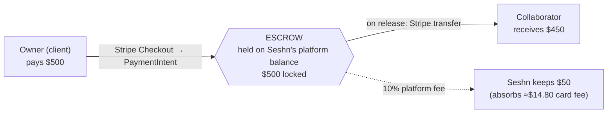
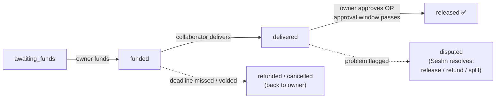

# Escrow — how the money moves

How a paid collaboration flows through Seshn, where the money sits, and how it
comes back into the app. The diagram lives next to this file as
[`escrow-flow.svg`](./escrow-flow.svg). Source of truth: `0012_escrow.sql`
(data model) and `lib/stripe/config.ts` (`computeCharge()`).

> Stripe is **dormant until keys are set** — the schema, math, and the funding /
> release flow are all in place; they activate the moment Stripe Connect keys are
> configured (see `.env.example`).

## The money flow (example: a $500 agreed fee)

Seshn uses a **vendor-side, flat-10%** model: the owner pays exactly the quoted
fee, and Seshn's 10% comes off the top of the collaborator's payout. The 10%
**absorbs Stripe's processing fee**, so there's no separate card charge and the
owner pays a clean, round number:

| Who | Amount | Why |
|---|---|---|
| **Owner pays** | **$500.00** | exactly the agreed fee — no markup, no card fee on top |
| Seshn keeps | $50.00 | 10% platform fee (`PLATFORM_FEE_BPS = 1000`) |
| ↳ of which Stripe takes | ≈ $14.80 | card processing (2.9% + 30¢ est.), absorbed by Seshn |
| **Seshn net** | ≈ $35.20 | platform fee minus the card fee |
| **Collaborator receives** | **$450.00** | fee − 10%, transferred on release |

`amount_charged = fee` · `platform_fee = round(fee × 10%)` · `net_to_collaborator
= fee − platform_fee`. Math lives in `computeCharge()` (`lib/stripe/config.ts`).

## The funding flow (what actually runs)

1. **Owner opens `/contract/[id]/fund`** — an in-app checkout that shows the order
   summary (fee, what the collaborator nets, the 10% fee) and the escrow
   protection steps.
2. **`POST /api/stripe/escrow/fund`** ensures one `escrows` row (`awaiting_funds`)
   for the contract, checks the collaborator's payout account is verified (so
   funds can be released later), and opens a **Stripe Checkout session** for the
   fee. The charge settles onto Seshn's platform balance — that hold *is* the
   escrow. No transfer happens at checkout.
3. **Webhook `checkout.session.completed`** → `markEscrowFunded()` flips the
   escrow to `funded` (idempotent on `awaiting_funds`) and audits it.
4. **Collaborator delivers** → `mark_delivered` RPC (0028) flips to `delivered`
   and starts the `auto_release_at` clock from `approval_window_days`.
5. **Owner approves** → `POST /api/stripe/escrow/release` creates a Stripe
   **Transfer** of `fee − platform_fee` to the collaborator's connected account
   (idempotency-keyed per escrow), marks the escrow `released`, and completes the
   contract. A future cron will call the same release on auto-release.

## The lifecycle (`escrow.status`)

- **awaiting_funds** — contract signed, not yet paid.
- **funded** — owner has paid; money is locked in escrow so the collaborator can start with confidence.
- **delivered** — collaborator submitted the work; the approval clock (`auto_release_at = now + approval_window_days`) starts.
- **released** — owner approved, or the window lapsed with no dispute; Stripe transfers the fee to the collaborator's payout account; contract → `completed`.
- **refunded / cancelled** — deadline missed before delivery, or the deal was voided pre-funding; money returns to the owner.
- **disputed** — either party flags a problem during the approval window; auto-release pauses and Seshn resolves it (release, refund, or split).

## How it surfaces in the app

| Step | Where in the app |
|---|---|
| Agree | Contract page — accept application, both sign |
| Fund | Contract page — "Fund escrow" (owner) |
| Deliver | Deliverables against the contract (collaborator) |
| Release | Owner approves on the contract, or the cron auto-release sweep fires |
| Settle | Finances dashboard — "Earned" (collaborator) / "Spent" (owner); bell notification on each state change |

Money is always stored in **cents** (`bigint`); currency is ISO-4217 and defaults to AUD.
