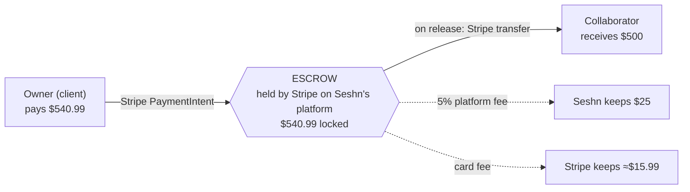
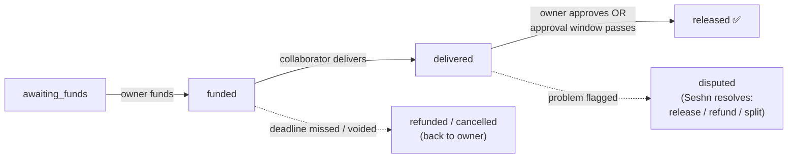

# Escrow — how the money moves

How a paid collaboration flows through Seshn, where the money sits, and how it
comes back into the app. The diagram lives next to this file as
[`escrow-flow.svg`](./escrow-flow.svg). Source of truth: `0012_escrow.sql`
(data model) and `lib/stripe/config.ts` (`computeCharge()`).

> Stripe is **dormant until keys are set** — the schema and math are in place;
> funding/release activate once Stripe Connect is configured.

## The money flow (example: a $500 agreed fee)

Seshn uses a **"payer covers all"** model, so the collaborator always nets the
exact fee they were quoted:

| Who | Amount | Why |
|---|---|---|
| **Owner pays** | **$540.99** | fee + platform fee + card fee |
| Seshn keeps | $25.00 | 5% platform fee (`PLATFORM_FEE_BPS`) |
| Stripe keeps | ≈ $15.99 | card processing (2.9% + 30¢ estimate) |
| **Collaborator receives** | **$500.00** | their full quote |

`amount = (fee + platform_fee + 30¢) / (1 − 2.9%)`, rounded up.

## The lifecycle (`escrow.status`)

- **awaiting_funds** — contract signed, not yet paid.
- **funded** — owner has paid; money is locked in escrow so the collaborator can start with confidence.
- **delivered** — collaborator submitted the work; the approval clock (`auto_release_at = now + approval_window_days`) starts.
- **released** — owner approved, or the window lapsed with no dispute; Stripe transfers the fee to the collaborator's payout account; contract → `completed`.
- **refunded / cancelled** — deadline missed before delivery, or the deal was voided pre-funding; money returns to the owner.
- **disputed** — either party flags a problem during the approval window; auto-release pauses and Seshn resolves it (release, refund, or split).

## How it surfaces in the app

| Step | Where in the app |
|---|---|
| Agree | Contract page — accept application, both sign |
| Fund | Contract page — "Fund escrow" (owner) |
| Deliver | Deliverables against the contract (collaborator) |
| Release | Owner approves on the contract, or the cron auto-release sweep fires |
| Settle | Finances dashboard — "Earned" (collaborator) / "Spent" (owner); bell notification on each state change |

Money is always stored in **cents** (`bigint`); currency is ISO-4217 and defaults to AUD.
